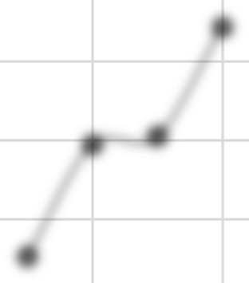

# ECL Calculation Using Logistic Regression

This repository contains the Expected Credit Loss (ECL) calculation model implemented using Logistic Regression for point-in-time default probabilities.

Below is the extracted content from the `ECL_Calculation_using_Logistic_regression.pdf` document:

---

## Page 1
### IND AS 109/IFRS 9 EXPECTED CREDIT LOSS (ECL) MODELLING

**A Comprehensive End-to-End Methodology from Raw Freddie Mac Mortgage Cohorts to Systemic Life-Cycle Provisions under IFRS 9 and Ind AS 109**

*   **Model Developer:** CA Sumit Mahato
*   **Reference Data Source:** Freddie Mac Single-Family Loan-Level Dataset (2015 Q1 – 2025 Q3)
*   **Regulatory Frameworks:** IFRS 9 (International Financial Reporting Standards) and Ind AS 109 (Indian Accounting Standard)

*All methodologies, parameter estimates, and views in this report reflect the model developer’s personal analytical work and are included for portfolio demonstration purposes. They are not presented as a corporate, institutional, or regulatory submission.*

---

## Page 2
### IFRS 9 / Ind AS 109 — Expected Credit Loss Modelling Framework
**CA Sumit Mahato**

#### Table of Contents
*   **Abstract** .................................................................................................................................................. 3
*   **Raw Data Ingestion and Quality Checks** .............................................................................................. 4
    *   1.1 Data Quality Checks and Cleaning .............................................................................................. 4
    *   1.2 Cohort Creation and Snapshot Filtering .................................................................................... 4
*   **Probability of Default (PD) Modelling** ................................................................................................. 5
    *   2.1 TTC Scorecard and Validation Metrics ...................................................................................... 5
        *   Weight of Evidence (WOE) ........................................................................................................... 5
        *   Information Value (IV) .................................................................................................................. 6
        *   Logistic Regression Scorecard ...................................................................................................... 7
        *   Model Development Workflow .................................................................................................... 8
        *   Fitted Scorecard Equation ............................................................................................................ 8
        *   Log-Shift Calibration (PD Alignment Method) ............................................................................ 9
        *   Model Validation: ROC-AUC, CAP-AUC, Gini, and Accuracy Ratio ........................................... 11
    *   2.2 Point-in-Time (PIT) PD and the Vasicek–Merton Model ....................................................... 14
        *   Macro Variable Specification and Z-Factor Construction ........................................................ 16
        *   Scenario Weighting Using the Empirical Rule (68% – 16% – 16%) ....................................... 17
        *   PD Term Structure Construction Using Survival Analysis ....................................................... 17
*   **Lifetime Loss Given Default (LGD) Modelling** .................................................................................  18
    *   3.1 Workout Parameter Estimates ................................................................................................ 19
*   **Exposure at Default (EAD) Modelling** ................................................................................................ 20
*   **Expected Credit Loss (ECL) Integration** ............................................................................................ 20
    *   5.1 Illustrative Staging Results ...................................................................................................... 20
    *   5.2 Period-by-Period ECL Term Structure ................................................................................... 21
*   **Model Limitations and Critical Assumptions** .................................................................................... 22
    *   6.1 Zero Intercept in the Macroeconomic Regression ................................................................. 22
    *   6.2 Selection of GDP YoY Growth at a Two-Quarter Lag ............................................................. 23
    *   6.3 Workout LGD on a Lifetime Basis ........................................................................................... 23
*   **Regulatory Context: IFRS 9 vs. Ind AS 109** ........................................................................................ 23
    *   7.1 Implementation Scope and the Indian Context ...................................................................... 23
    *   7.2 Staging and Significant Increase in Credit Risk (SICR) .......................................................... 24
    *   7.3 Macro-Financial Calibration .................................................................................................... 24
    *   7.4 Quantitative Observations and Comparative Analysis ............................................................... 24

---

## Page 3
### IFRS 9 / Ind AS 109 — Expected Credit Loss Modelling Framework
**CA Sumit Mahato**

#### Abstract
This report develops an end-to-end expected credit loss modelling framework for residential mortgage portfolios. It begins with raw Freddie Mac loan-level data, applies data quality checks and cohort construction, estimates TTC and PIT PD models, derives lifetime LGD and EAD components, and integrates them into IFRS 9 and Ind AS 109 compliant ECL calculations. The framework is intended as a portfolio demonstration of practical credit risk modelling rather than an official regulatory submission.

This report presents an empirical, end-to-end implementation of the IFRS 9 and Ind AS 109 Expected Credit Loss framework for residential mortgage portfolios. The analysis begins with a raw sample of 10,000 loans drawn from the Freddie Mac Single-Family Loan-Level Dataset covering 2015 through 2025Q3 and develops the modelling components needed to estimate portfolio-level credit provisions. The model architecture integrates a static Through-the-Cycle (TTC) Probability of Default (PD) scorecard, a forward-looking Point-in-Time (PIT) macro-financial Vasicek–Merton linkage, a lifetime workout Loss Given Default (LGD) model with House Price Index (HPI) property indexation, and a contractual Exposure at Default (EAD) amortisation schedule. The report documents raw data pre-processing, Weight of Evidence (WOE) variable binning, snapshot filtering, and credit staging rules, together with the key modelling limitations encountered — specifically the constraint of forcing a zero intercept in the systematic Z-score regression to preserve statistical significance (p-value < 5%), and the lag selection of macroeconomic variables (GDP YoY growth lagged by two quarters) required to maintain economically consistent sign behaviour. LGD is evaluated purely on a lifetime basis using realised workout dynamics. All findings represent the personal assessments of the model developer.

---

## Page 4
### IFRS 9 / Ind AS 109 — Expected Credit Loss Modelling Framework
**CA Sumit Mahato**

### CHAPTER 1: Raw Data Ingestion and Quality Checks
The model is constructed starting from raw mortgage files. The primary source is the Freddie Mac Single-Family Loan-Level Dataset, which provides loan-level credit performance history. The raw dataset contains extensive fields tracking origination characteristics and monthly reporting records.

#### 1.1 Data Quality Checks and Cleaning
Prior to statistical estimation, the raw database is subjected to the following data validation rules:
*   **FICO Score Validation** — FICO scores are verified to fall within the standard credit range of 300 to 850. Records with missing or anomalous FICO codes (e.g., 9999) are excluded.
*   **Loan-to-Value (LTV) Bounds** — Original LTV and Combined LTV (CLTV) ratios must be positive and are capped at 150% to exclude data-entry errors. Realised values above 80% indicate the presence of private mortgage insurance.
*   **Debt-to-Income (DTI) Check** — DTI ratios are validated to be under 65%. Loans exceeding this threshold are inspected for data consistency and removed if deemed non-standard.
*   **Delinquency Status Mapping** — The raw delinquency history code is mapped where ‘0’ represents current, ‘1’ is 30–59 days past due, and ‘3’ or higher (90+ days past due) is classified as default.
*   **Outstanding UPB and Zero-Balance Reconciliation** — Monthly unpaid principal balance (UPB) is reconciled. Zero-balance codes are checked to identify the termination type (e.g., Code ‘01’ for prepayments, Code ‘03’ for short sale, Code ‘09’ for REO disposition/default).

#### 1.2 Cohort Creation and Snapshot Filtering
A cohort of 10,000 loans is selected from the 2015–2025 Q3 database using a stratified random sampling technique. Historical snapshots are generated from this cohort using 12-month performance windows at quarterly snapshot frequency. To model default risk, a strict filtration rule is applied: only snapshots where the loan is non-defaulted at the snapshot date are selected. The loan is then tracked forward to determine whether it defaults or remains performing within the subsequent 12 months, creating the binary target variable for the Probability of Default model.

A vintage curve analysis tracks cumulative default rates by months on book across origination cohorts. The analysis shows how default behaviour evolves as loans season, with younger vintages displaying higher early-life PDs because they have limited amortisation, higher effective LTVs, and thinner equity buffers. When a macroeconomic shock occurs, the least-seasoned vintage absorbs the impact most sharply, producing a steeper and higher cumulative PD path. This makes vintage analysis essential for lifetime PD calibration, term-structure modelling, and understanding seasoning effects within the IFRS 9 ECL framework. The analysis confirms that defaults peak between 36 and 60 months on book, verifying the stabilisation of default behaviour and justifying the 12-month default performance window used for target construction.

---

## Page 5
### IFRS 9 / Ind AS 109 — Expected Credit Loss Modelling Framework
**CA Sumit Mahato**

### CHAPTER 2: Probability of Default (PD) Modelling
Default risk is modelled in two phases: a static Through-the-Cycle (TTC) scorecard, and a Point-in-Time (PIT) macro-financial adjustment layered on top of it.

#### 2.1 TTC Scorecard and Validation Metrics
The cohort data is split into a Development Set (originations prior to 2021) and a Validation Set (originations from 2021 onwards). Underwriting variables are transformed using the Weight of Evidence (WOE) technique, and variables are selected based on their Information Value (IV).

##### Weight of Evidence (WOE)
Weight of Evidence is a feature-engineering technique used to transform raw variables into stable, monotonic predictors for credit risk models. It converts each bin of a variable into the log-odds of good versus bad accounts, making the relationship with default risk clearer and more interpretable:

$$WOE_i = \ln \left( \frac{\% \text{ Good}_i}{\% \text{ Bad}_i} \right)$$

#### Vintage Curve and Weight of Evidence (WoE) Binned Variables

  
  
  

Benefits of the WOE transformation include:
*   Enforces monotonicity, reducing model instability.
*   Makes logistic regression coefficients interpretable in log-odds terms.
*   Handles categorical variables without dummy encoding.
*   Improves model robustness across development, validation, and out-of-time samples.

For these reasons, WOE is used as a core feature-engineering transformation in the PD scorecard and IFRS 9 ECL modelling framework.

##### Information Value (IV)
Information Value measures how well a variable separates good and bad accounts after binning, and is used for variable screening prior to model development:

$$IV = \sum \left[ WOE_i \times \left( \% \text{ Good}_i - \% \text{ Bad}_i \right) \right]$$

| IV Range | Interpretation |
| :--- | :--- |
| < 0.02 | Not predictive — exclude |
| 0.02 – 0.10 | Weak predictor |
| 0.10 – 0.30 | Medium / useful predictor |
| 0.30 – 0.50 | Strong predictor |
| > 0.50 | Too strong — often indicates target leakage |

*Table 2.1 — Standard Information Value (IV) interpretation bands*

Among the underwriting variables screened, original interest rate shows a relatively high IV (≈ 0.30), indicating strong predictive power, while variables such as number of units show a very low IV (≈ 0.02), suggesting limited usefulness. The final logistic regression scorecard retains three variables: FICO score, original CLTV and DTI.

---

## Page 7
### IFRS 9 / Ind AS 109 — Expected Credit Loss Modelling Framework
**CA Sumit Mahato**

##### Exclusion of Interest Rate from the Scorecard Model
The `orig_interest_rate` variable was excluded from the final scorecard due to a severe macroeconomic and structural population drift between the Development and out-of-time Test sets.
*   **Development Period (up to end of 2020):** The mortgage portfolio was calibrated in a standard pricing environment where only 14.71% of borrowers had interest rates below 3.0%, and 35.11% of borrowers had interest rates between 4.0% and 5.0%.
*   **Out-of-Time Period (post-2021):** During this period, mortgage rates fell to historic lows. Borrowers who were creditworthy and had clean credit histories took advantage of the low-interest-rate environment and refinanced their loans, prepaying their existing exposures. As a result, the share of loans with interest rates under 3.0% in the Test set surged to 50.29%.
*   **Refinancing Lock-in:** Conversely, borrowers who remained on interest rates above 5.0% post-2021 (which grew to 13.17% of the OOT portfolio) were primarily those who were unable to refinance. This refinancing constraint was typically due to credit issues (e.g., defaults, late payments, or poor credit history) or other financial distress.

Consequently, the interest rate variable stopped behaving as a standard risk pricing predictor and instead became a proxy for refinancing constraints and credit impairment. This structural shift caused the interest rate's Characteristic Stability Index (CSI) to spike to 118.46%. Retaining it would have introduced severe, non-credit population drift and biased the scorecard's predictive accuracy. Excluding it successfully stabilized the scorecard-level Population Stability Index (PSI) at an exceptionally low 0.29%, ensuring the model's long-term robustness.

##### Logistic Regression Scorecard
Logistic regression is the core statistical method used to estimate Probability of Default in IFRS 9 and Basel-aligned credit risk models. It models the relationship between borrower characteristics and the likelihood of default by converting a linear combination of predictors into a probability between 0 and 1:

$$PD = \frac{1}{1 + e^{-L}}$$
$$L = \beta_0 + \beta_1 x_1 + \beta_2 x_2 + \dots + \beta_k x_k$$

---

## Page 8
### IFRS 9 / Ind AS 109 — Expected Credit Loss Modelling Framework
**CA Sumit Mahato**

Logistic regression is preferred for scorecard development because it produces a natural probability output, offers interpretable coefficients in log-odds terms, remains stable with monotonic WOE-transformed variables, is widely accepted by regulators as a standard scorecard method, and — through the binning and WOE transformation step — is able to capture non-linear risk patterns while keeping the estimation itself simple and auditable.

##### Model Development Workflow
*   Variable screening — use Information Value to select predictive variables.
*   Feature engineering — apply WOE transformation to enforce monotonicity and reduce noise.
*   Model estimation — fit the logistic regression using maximum likelihood.
*   Validation — assess Gini, KS, ROC, calibration, and stability across development and out-of-time samples.
*   PD term structure — convert point-in-time PDs into lifetime PDs for ECL using vintage curves, survival models, or transition matrices.

Each coefficient $\beta_i$ represents the change in log-odds of default for a one-unit increase in the corresponding WOE-transformed predictor: a positive coefficient increases PD, a negative coefficient decreases PD, and the magnitude reflects the strength of the effect — making the model transparent and audit-friendly.

##### Fitted Scorecard Equation
$$\ln\left[ \frac{p}{1-p} \right] = -5.1124 - 1.5073 \cdot WOE(\text{FICO}) - 0.8287 \cdot WOE(\text{CLTV}) - 0.7961 \cdot WOE(\text{DTI})$$

| Variable | Coefficient | Significance | Economic Interpretation |
| :--- | :--- | :--- | :--- |
| Intercept | -5.112430 | p < 1% | Base log-odds of default in the portfolio |
| WOE (FICO) | -1.507340 | p < 1% | Lower credit score increases default risk |
| WOE (CLTV) | -0.828668 | p < 1% | Higher loan-to-value increases default risk |
| WOE (DTI) | -0.796056 | p < 1% | Higher debt-to-income increases default risk |

*Table 2.2 — Fitted logistic regression coefficients on WOE-transformed variables*

---

## Page 9
### IFRS 9 / Ind AS 109 — Expected Credit Loss Modelling Framework
**CA Sumit Mahato**

The resulting scorecard maps borrowers into a master rating scale comprising seven risk grades, where Grade 1 represents the highest credit quality and Grade 7 represents default.

| Grades/Pools | Long-run PD | ODR | Distribution | AE | Distribution2 |
| :--- | :---: | :---: | :---: | :---: | :---: |
| 1 | 0.08% | 0.10% | 5.84% | 0.03% | 3,907 |
| 2 | 0.17% | 0.27% | 13.09% | 0.10% | 8,763 |
| 3 | 0.34% | 0.44% | 23.51% | 0.09% | 15,731 |
| 4 | 0.66% | 0.75% | 35.46% | 0.09% | 23,727 |
| 5 | 1.47% | 1.40% | 14.62% | 0.07% | 9,786 |
| 6 | 2.42% | 2.44% | 7.16% | 0.02% | 4,793 |
| 7 | 5.26% | 3.76% | 0.32% | 1.50% | 213 |
| **MAE** | | | **1.90%** | | **66,920** |

*Estimated PD: 0.74%, Observed PD: 0.80%*

##### Log-Shift Calibration (PD Alignment Method)
Log-shift calibration is a standard technique used in IFRS 9 PD modelling to align model-estimated PDs with the portfolio-level Observed Default Rate (ODR) while preserving the ranking and monotonicity of the model. Instead of re-estimating the entire logistic regression, a constant shift is applied to the logit of the predicted PDs.

Model-estimated PDs often differ from actual portfolio default rates because of data imbalance, macroeconomic shocks, sample-specific effects, or conservative underwriting and seasoning differences. To ensure the model reflects current portfolio risk, PDs must be calibrated to the observed default rate.

$$\text{logit}(PD_{\text{model}}) = \ln\left[ \frac{PD_{\text{model}}}{1 - PD_{\text{model}}} \right]$$
$$\text{logit}(PD_{\text{calibrated}}) = \text{logit}(PD_{\text{model}}) + k$$

---

## Page 10
### IFRS 9 / Ind AS 109 — Expected Credit Loss Modelling Framework
**CA Sumit Mahato**

$$PD_{\text{calibrated}} = \frac{1}{1 + e^{-(\text{logit}(PD_{\text{model}}) + k)}}$$

The constant $k$ is chosen so that the average calibrated PD equals the portfolio ODR, ensuring that the calibrated PDs match the observed default rate while preserving the model’s borrower ranking.

Key advantages of this method are that it preserves the relative risk ranking of borrowers, maintains the monotonicity of WOE-based variable relationships, is simple and transparent to audit and explain to regulators, can be applied at portfolio or segment level, and is stable — avoiding the need to re-estimate the logistic model every reporting period.

Log-shift calibration is typically used when model PDs are systematically higher or lower than actual defaults, when aligning PDs to Point-in-Time conditions, when converting model PDs into lifetime PD term structures, and when performing vintage-level calibration for ECL.

##### PD Calibration for testing data
| Grade | Rated A/cs | Defaults | ODR | Observed Log Odds (bad/good) | Fitted Log of odds | Model Fitted PD | SSE | Predicted Defaults |
| :--- | :---: | :---: | :---: | :---: | :---: | :---: | :---: | :---: |
| 1 | 3,907 | 4 | 0.10% | -6.8832 | -6.6321 | 0.13% | 0.0631 | 5.14 |
| 2 | 8,763 | 24 | 0.27% | -5.8975 | -6.0425 | 0.24% | 0.0210 | 20.77 |
| 3 | 15,731 | 69 | 0.44% | -5.4249 | -5.4529 | 0.43% | 0.0008 | 67.10 |
| 4 | 23,727 | 177 | 0.75% | -4.8907 | -4.8633 | 0.77% | 0.0008 | 181.88 |
| 5 | 9,786 | 137 | 1.40% | -4.2546 | -4.2738 | 1.37% | 0.0004 | 134.44 |
| 6 | 4,793 | 117 | 2.44% | -3.6880 | -3.6842 | 2.45% | 0.0000 | 117.44 |
| 7 | 213 | 8 | 3.76% | -3.2436 | -3.0946 | 4.33% | 0.0222 | 9.23 |
| **Total**| **66,920** | **536** | | **-2.29452317** | | **0.80%** | **0.1082** | **536.00** |

*   Assumed Target Central Tendency as ODR: 0.80%
*   Slope: 58.96%
*   Calibrated PD: 0.80%
*   Intercept: -725.58%
*   Delta: 3.42%
*   R-Square: 98.98%

---

## Page 11
### IFRS 9 / Ind AS 109 — Expected Credit Loss Modelling Framework
**CA Sumit Mahato**

#### Model Validation: ROC-AUC, CAP-AUC, Gini, and Accuracy Ratio
Robust model validation ensures that the PD model discriminates well between good and bad accounts and remains stable across development, validation, and out-of-time samples. Four discriminatory power metrics are used together: ROC-AUC, CAP-AUC, the Gini coefficient, and the Accuracy Ratio (AR).
*   **ROC Curve and ROC-AUC** — the ROC curve plots the True Positive Rate against the False Positive Rate across all score thresholds. ROC-AUC measures the probability that the model ranks a randomly chosen defaulter higher than a non-defaulter, ranging from 0.5 (random) to 1.0 (perfect); retail PD models typically show ROC-AUC between 0.65 and 0.80.
*   **CAP Curve and CAP-AUC** — the Cumulative Accuracy Profile plots the cumulative share of defaults captured against the cumulative share of the population sorted by model score. A steeper CAP curve indicates stronger discriminatory power, and CAP-AUC is always higher than ROC-AUC because it measures cumulative capture rather than TPR/FPR.
*   **Gini Coefficient** — derived directly from ROC-AUC as $\text{Gini} = 2 \times \text{ROC-AUC} - 1$, ranging from 0 (random) to 1 (perfect); it is the most common single-number summary of discriminatory power.
*   **Accuracy Ratio (AR)** — mathematically equivalent to the Gini coefficient, comparing the model’s CAP curve to the perfect and random curves; often reported alongside CAP-AUC in regulatory documentation.

Together, these measures demonstrate that the model ranks borrowers correctly, captures defaults efficiently, and maintains performance over time — properties that are essential for IFRS 9 lifetime ECL estimation. A well-validated PD model should show a high ROC-AUC and Gini, a CAP curve significantly above the random line, and stable metrics across the development and out-of-time datasets.

---

## Page 12
### IFRS 9 / Ind AS 109 — Expected Credit Loss Modelling Framework
**CA Sumit Mahato**

*   **Figure 2.1** — ROC curve: True Positive Rate vs. False Positive Rate across score thresholds
*   **Figure 2.2** — CAP curve: cumulative share of defaults captured vs. cumulative population share

##### Key Metrics Summary
| Dataset | AUC | Gini | CAP_AUC | AR |
| :--- | :---: | :---: | :---: | :---: |
| Dev | 0.70 | 39.05% | 0.69 | 39.05% |
| Test | 0.74 | 48.93% | 0.74 | 48.93% |

The model shows stronger discriminatory performance on the Validation dataset (AUC = 0.74, Gini = 48.93%) than on the development dataset (AUC = 0.70, Gini = 39.05%). This supports the stability of the WOE binning and scorecard design, although the result should still be monitored for sample-period effects and possible differences in portfolio composition between the development and Validation sets.

---

## Page 13
### IFRS 9 / Ind AS 109 — Expected Credit Loss Modelling Framework
**CA Sumit Mahato**

The Kolmogorov–Smirnov (KS) statistic was evaluated on both development (DEV) and out-of-time (OOT) datasets to assess the model’s discrimination capability. The DEV KS peaked at approximately 30%, indicating acceptable separation between defaulters and non-defaulters. The OOT KS peaked slightly above 40%, demonstrating stronger rank-ordering on unseen data and confirming that the model generalizes well without signs of overfitting. The KS curves for both datasets exhibit the expected monotonic pattern, validating the model’s stability across time.

##### Population Stability Index (PSI)
The Population Stability Index (PSI) measures how much the distribution of a variable (score, PD, grade, etc.) has shifted over time compared to a baseline period (usually DEV). It is used to detect portfolio drift, model drift, and changes in customer mix:

$$PSI = \sum \left[ (A - E) \cdot \ln\left(\frac{A}{E}\right) \right]$$

---

## Page 14
### IFRS 9 / Ind AS 109 — Expected Credit Loss Modelling Framework
**CA Sumit Mahato**

##### Characteristic Stability Index (CSI)
The Characteristic Stability Index (CSI) measures how much the distribution of an individual predictor variable (e.g., age, income, utilization, bureau score, DTI, inquiries, etc.) has changed between the development (DEV) dataset and the out-of-time (OOT) dataset. It is used to detect feature-level drift, data quality issues, and changes in customer characteristics over time. CSI uses the same mathematical formula as PSI:

$$CSI = \sum \left[ (A - E) \cdot \ln\left(\frac{A}{E}\right) \right]$$

#### 2.2 Point-in-Time (PIT) PD and the Vasicek–Merton Model
To capture cyclical economic effects, a standard normal systematic factor Z(t) is extracted from Point-in-Time default rates using the Vasicek formula, with an asset correlation of $\rho = 0.2293$. The systematic factor Z(t) is then regressed against two macroeconomic variables (MEVs): the Unemployment Rate and GDP YoY Growth (lagged two quarters).

---

## Page 15
### IFRS 9 / Ind AS 109 — Expected Credit Loss Modelling Framework
**CA Sumit Mahato**

$$PD_{\text{cond}}(t) = \Phi \left( \frac{\Phi^{-1}(PD_{\text{TTC}}) - \sqrt{\rho} \cdot Z(t)}{\sqrt{1 - \rho}} \right)$$

The fitted macroeconomic regression equation is:

$$Z(t) = -13.0926 \times \text{Unemployment\_Rate} + 93.7828 \times \text{GDP\_YoY\_Growth}$$

The PD term structure is built by forecasting the macro variables via AR(1) specifications and calculating probability-weighted unconditional and conditional PDs under Baseline, Optimistic, and Pessimistic scenarios.

| Independent Variable | Coefficient | Std. Error | t-Statistic | Significance |
| :--- | :---: | :---: | :---: | :---: |
| Intercept (forced zero) | 0.000000 | N/A | N/A | Excluded |
| Unemployment Rate (Lag 1) | -13.092597 | 2.710430 | -4.830450 | p < 0.1% |
| GDP YoY Growth (Lag 2) | 93.782793 | 36.560086 | 2.565169 | p < 2% |

*Table 2.4 — Macro-financial regression of the systematic factor Z(t) on unemployment and GDP growth*

---

## Page 16
### IFRS 9 / Ind AS 109 — Expected Credit Loss Modelling Framework
**CA Sumit Mahato**

##### Macro Variable Specification and Z-Factor Construction
In the macro-PD regression, GDP YoY growth is included with a two-quarter lag, while the Unemployment Rate is included with a one-quarter lag. This specification is driven by empirical limitations observed during model development: only the combination of Lag-2 GDP YoY growth and Lag-1 unemployment produced economically consistent (positive) coefficients when regressed against the extracted Z-factor. The two-period lag for GDP reflects the slower transmission of economic output changes into borrower distress, whereas unemployment reacts faster and therefore requires only a one-period lag for predictive accuracy.

Alternative example where using simple QoQ change but due to wrong sign it is dropped, and all other combinations of HPI and GDP have been checked, and only this alternative met both sign and p-value tests:

| Coefficients | Standard Error | t Stat | P-value | Lower 95% | Upper 95% |
| :--- | :---: | :---: | :---: | :---: | :---: |
| Intercept | 1.188186 | 0.282369 | 4.207913 | 0.000215 | 0.611511 |
| Unemployment Rate | -26.655780 | 5.350716 | -4.981723 | 0.0000255 | 37.583399 |
| USSTHPI_% change | -14.111265 | 6.290126 | -2.243399 | 0.032408 | 26.957417 |

For scenario conditioning, the baseline macro path is anchored at the 50th percentile, while the pessimistic and optimistic scenarios are constructed using the 5th and 95th percentiles respectively. These percentile-based macro inputs are fed into the regression model to generate predicted Z-values, which are then transformed into Point-in-Time PDs using the Vasicek–Merton formulation:

$$PD_t = \Phi \left( \frac{\Phi^{-1}(PD_{\text{TTC}}) - \sqrt{\rho} \cdot Z_t}{\sqrt{1 - \rho}} \right)$$

This approach ensures that the PD term structure is fully responsive to macroeconomic conditions while remaining consistent with the underlying asset-correlation framework.

---

## Page 17
### IFRS 9 / Ind AS 109 — Expected Credit Loss Modelling Framework
**CA Sumit Mahato**

##### Scenario Weighting Using the Empirical Rule (68% – 16% – 16%)
Scenario weights for the Baseline, Pessimistic, and Optimistic paths are assigned using the empirical rule, which assumes that macroeconomic shocks follow an approximately normal distribution. Under this rule, 68% of outcomes lie within one standard deviation of the mean, with the remaining 32% split equally into the lower and upper tails:
*   **Baseline Scenario** — 68% weight, representing the central, most probable macroeconomic path (50th percentile).
*   **Pessimistic Scenario** — 16% weight, corresponding to downside stress conditions aligned with the 5th percentile macro assumptions.
*   **Optimistic Scenario** — 16% weight, representing upside conditions aligned with the 95th percentile macro assumptions.

This weighting structure ensures that the ECL model reflects a probability-weighted, forward-looking view, consistent with IFRS 9 requirements. After applying these weights, the macro variables feed into the regression to generate predicted Z-values, which are then transformed into grade-level PD term structures using the Vasicek–Merton framework.

##### PD Term Structure Construction Using Survival Analysis
Once the predicted Z-values are obtained, grade-level annual PDs are computed and then converted into quarterly PDs to match the IFRS 9 requirement of lifetime, period-by-period default probabilities, using the standard transformation:

$$PD_{\text{quarter}} = 1 - (1 - PD_{\text{annual}})^{1/4}$$

Survival analysis is then applied to convert conditional PDs into unconditional PDs. The conditional PD represents the probability of default given survival until the start of the period, whereas the unconditional PD represents the probability of default from time zero, incorporating the cumulative survival probability up to each quarter:

---

## Page 18
### IFRS 9 / Ind AS 109 — Expected Credit Loss Modelling Framework
**CA Sumit Mahato**

$$PD_t^{\text{uncond}} = S_{t-1} \times PD_t^{\text{cond}}$$

where $PD_t^{\text{cond}}$ is the quarterly conditional PD, $S_{t-1}$ is the survival probability up to quarter $t-1$, and $PD_t^{\text{uncond}}$ is the unconditional PD used in the ECL calculation.

Survival probability is updated each quarter as:

$$S_t = S_{t-1} \times (1 - PD_t^{\text{cond}})$$

This framework produces a fully forward-looking PD term structure, consistent with macroeconomic conditions, borrower risk grades, and IFRS 9 lifetime ECL requirements.

### CHAPTER 3: Lifetime Loss Given Default (LGD) Modelling
Consistent with the revised modelling framework, Loss Given Default (LGD) is calculated on a lifetime basis using realised workout cash flows. Parametric Beta regression methods were evaluated during development but were not used in the final implementation.

Workout LGD represents the lifetime realised loss on defaulted loans, tracking property-level liquidations. The property value at default is indexed to the sale date using the House Price Index (HPI).

To estimate property value at default, ELTV is used as a proxy, where the current property value is derived by scaling the outstanding balance with the estimated loan-to-value ratio. The zero-balance date is assumed to represent the effective sale/liquidation date, and the first-time default balance is taken as EAD for LGD computation, ensuring consistency with industry practice and the Freddie Mac data structure.

---

## Page 19
### IFRS 9 / Ind AS 109 — Expected Credit Loss Modelling Framework
**CA Sumit Mahato**

$$\text{Indexed Property Value} = \text{Property\_Value}(\text{default}) \times \left( \frac{\text{HPI}(\text{sale})}{\text{HPI}(\text{default})} \right)$$

Realised loss is calculated as:

$$\text{Realised Loss} = \text{UPB}(\text{default}) + \text{Accrued Interest} + \text{Direct Liquidation Expenses} - \text{Net Sale Proceeds} - \text{MI Recoveries}$$

##### 3.1 Workout Parameter Estimates
| Parameter | Estimated Value | Methodology & Source Detail |
| :--- | :---: | :--- |
| Cure Rate (zero loss) | 25.00% | Weighted average probability of returning to performing status |
| Property Haircut | 43.37% | Weighted average discount on property value at sale relative to default |
| Direct Liquidation Cost | 12.81% | Weighted average legal, maintenance, and transaction costs relative to UPB |
| Time-to-Resolution (TTR) | 2.43 years | Weighted average duration from first default to zero-balance date |

*Table 3.1 — Estimated lifetime workout LGD parameters*

These four parameters — cure rate, property haircut, direct liquidation cost, and time-to-resolution — together define the lifetime LGD term structure that is subsequently combined with the PD term structure and EAD schedule to compute period-by-period Expected Credit Loss. LGD is shown for one representative loan.

---

## Page 20
### IFRS 9 / Ind AS 109 — Expected Credit Loss Modelling Framework
**CA Sumit Mahato**

### CHAPTER 4: Exposure at Default (EAD) Modelling
Exposure at Default models the outstanding loan exposure at the point of default. For the representative residential mortgage, EAD is projected dynamically over the loan lifecycle using a contractual amortisation schedule based on a $1,000,000 origination balance, a 120-month maturity term, and a 12% annual contractual interest rate. Cash flows are discounted to the reporting date using the monthly Effective Interest Rate (EIR = 1.042%), ensuring that the EAD schedule feeding into the ECL calculation is fully consistent with the loan’s contractual amortisation profile and the time value of money.

### CHAPTER 5: Expected Credit Loss (ECL) Integration
Expected Credit Loss is calculated as the product of the marginal PIT Probability of Default (PD), the lifetime Loss Given Default (LGD), and the outstanding Exposure at Default (EAD), discounted back to the reporting date using the Effective Interest Rate (EIR):

$$ECL_t = PD_t \times LGD_t \times EAD_t \times (1 + EIR)^{-t}$$

Loans are classified into stages based on their credit quality migration. Stage 1 loans require a 12-month ECL (sum of discounted losses from months 1 to 12), while Stage 2 and Stage 3 loans require lifetime ECL (months 1 to 120). Staging logic has been corrected to ensure defaulted loans (Grade 8) are correctly assigned to Stage 3.

#### 5.1 Illustrative Staging Results
Staging results below are illustrated for a representative mortgage with a $1,000,000 origination balance, 120-month term, and 12% contractual interest rate:

| Staging Category | Expected Credit Loss | ECL as % of EAD | Underlying Impairment Rule |
| :--- | :---: | :---: | :--- |
| Stage 1 (Performing) | $4,371.83 | 0.463% | 12-month expected losses (quarters 1–4) |
| Stage 2 (Underperforming) | $12,478.39 | 1.322% | Lifetime expected losses (quarters 1–36) |
| Stage 3 (Credit-Impaired) | $12,478.39 | 1.322% | Lifetime expected losses (Grade 8 default status) |

*Table 5.1 — Illustrative ECL staging results for a representative mortgage*

---

## Page 21
### IFRS 9 / Ind AS 109 — Expected Credit Loss Modelling Framework
**CA Sumit Mahato**

#### 5.2 Period-by-Period ECL Term Structure
The complete period-by-period ECL term structure calculation for the representative loan is presented below, showing the marginal PD, lifetime LGD, exposure, discount factor, and resulting expected loss for each quarter of the amortisation schedule:

| Qtr | Month | Marginal PD | Lifetime LGD | Exposure (EAD) | Discount Factor | Expected Loss |
| :---: | :---: | :---: | :---: | :---: | :---: | :---: |
| Q1 | 15 | 0.002573 | 0.444646 | $973,214.00 | 0.969381 | $1,079.18 |
| Q2 | 18 | 0.002908 | 0.435681 | $957,926.03 | 0.939699 | $1,140.36 |
| Q3 | 21 | 0.003014 | 0.426211 | $942,174.82 | 0.910926 | $1,102.56 |
| Q4 | 24 | 0.003085 | 0.416189 | $925,946.33 | 0.883034 | $1,049.73 |
| Q5 | 27 | 0.003133 | 0.405564 | $909,226.10 | 0.855996 | $989.07 |
| Q6 | 30 | 0.003167 | 0.394279 | $891,999.24 | 0.829786 | $924.30 |
| Q7 | 33 | 0.003190 | 0.382268 | $874,250.38 | 0.804378 | $857.63 |
| Q8 | 36 | 0.003206 | 0.369455 | $855,963.72 | 0.779748 | $790.44 |
| Q9 | 39 | 0.003215 | 0.355755 | $837,122.95 | 0.755873 | $723.67 |
| Q10 | 42 | 0.003220 | 0.341070 | $817,711.28 | 0.732729 | $657.93 |
| Q11 | 45 | 0.003221 | 0.325286 | $797,711.43 | 0.710293 | $593.63 |
| Q12 | 48 | 0.003219 | 0.308270 | $777,105.55 | 0.688544 | $531.04 |
| Q13 | 51 | 0.003005 | 0.289870 | $755,875.30 | 0.667461 | $439.40 |
| Q14 | 54 | 0.002893 | 0.269905 | $734,001.75 | 0.647024 | $370.85 |
| Q15 | 57 | 0.002827 | 0.248161 | $711,465.42 | 0.627212 | $313.03 |
| Q16 | 60 | 0.002782 | 0.224384 | $688,246.20 | 0.608008 | $261.23 |
| Q17 | 63 | 0.002749 | 0.198270 | $664,323.43 | 0.589391 | $213.42 |
| Q18 | 66 | 0.002723 | 0.169449 | $639,675.76 | 0.571344 | $168.64 |

---

## Page 22
### IFRS 9 / Ind AS 109 — Expected Credit Loss Modelling Framework
**CA Sumit Mahato**

| Qtr | Month | Marginal PD | Lifetime LGD | Exposure (EAD) | Discount Factor | Expected Loss |
| :---: | :---: | :---: | :---: | :---: | :---: | :---: |
| Q19 | 69 | 0.002702 | 0.137470 | $614,281.25 | 0.553850 | $126.36 |
| Q20 | 72 | 0.002684 | 0.101777 | $588,117.26 | 0.536891 | $86.24 |
| Q21 | 75 | 0.002668 | 0.061672 | $561,160.48 | 0.520452 | $48.05 |
| Q22 | 78 | 0.002654 | 0.016274 | $533,386.88 | 0.504516 | $11.62 |
| Q23 | 81 | 0.002642 | 0.000000 | $504,771.71 | 0.489068 | $0.00 |
| Q24 | 84 | 0.002630 | 0.000000 | $475,289.47 | 0.474093 | $0.00 |

*Table 5.2 — Quarterly ECL term structure for the representative mortgage (Quarters 1–24 of 40)*

### CHAPTER 6: Model Limitations and Critical Assumptions
This section documents the main limitations and statistical assumptions used in the ECL modelling framework. These choices reflect practical trade-offs made during model development to preserve statistical significance, economic interpretation, and model stability.

#### 6.1 Zero Intercept in the Macroeconomic Regression
The regression model linking the systematic factor Z(t) to the macro-variables has its intercept forced to zero. This choice was implemented to ensure that the p-values of the Unemployment Rate and GDP YoY Growth coefficients remained strictly below the 5% statistical significance threshold. Without

---

## Page 23
### IFRS 9 / Ind AS 109 — Expected Credit Loss Modelling Framework
**CA Sumit Mahato**

forcing a zero intercept, the macro variables fail to meet the significance criteria required for regulatory variable acceptance.

#### 6.2 Selection of GDP YoY Growth at a Two-Quarter Lag
GDP YoY Growth was incorporated with a two-quarter lag. This lag structure was selected because it maintained the expected economic relationship between GDP growth and default risk while keeping the coefficient statistically significant at the 5% level. Lags of zero or one quarter produced either counter-intuitive signs or weaker statistical significance.

#### 6.3 Workout LGD on a Lifetime Basis
Realised LGD is estimated purely on a lifetime workout basis. The model assumes that the historical average property haircut of 43.37% and direct liquidation cost of 12.81% are representative of future property liquidation recovery paths, and that workout behaviour and the observed cure rate of 25% remain stable over the lifetime horizon.

##### Model Developer’s Disclaimer
All quantitative methodologies, data quality checks, model parameters, regression assumptions, limitations, staging logic, and credit risk results documented in this report represent the personal views and assessments of the model developer. They are not intended to represent official corporate or institutional positions.

### CHAPTER 7: Regulatory Context: IFRS 9 vs. Ind AS 109
Ind AS 109 (Indian Accounting Standard 109) is the accounting standard designed to align Indian financial reporting with IFRS 9. While the two frameworks share identical underlying principles — specifically the three-stage impairment model, lifetime expected loss computations, and Point-in-Time macroeconomic adjustments — their implementation landscapes differ significantly.

#### 7.1 Implementation Scope and the Indian Context
In the Indian financial system, Ind AS 109 has been implemented for Non-Banking Financial Companies (NBFCs) with an asset size exceeding Rs. 250 crore. Commercial banks in India, however, continue to calculate credit provisions under the Reserve Bank of India’s (RBI) traditional incurred-loss framework, specifically the Asset Classification and Provisioning norms. The RBI has released directions detailing the transition roadmap to expected credit loss provisioning for banks which is applicable since 1st April 2027, making the quantitative frameworks modelled in this study highly relevant to the upcoming regulatory environment.

---

## Page 24
### IFRS 9 / Ind AS 109 — Expected Credit Loss Modelling Framework
**CA Sumit Mahato**

#### 7.2 Staging and Significant Increase in Credit Risk (SICR)
Under both IFRS 9 and Ind AS 109, a critical assessment is whether an asset has experienced a Significant Increase in Credit Risk (SICR) since origination. Both frameworks share the rebuttable presumption that credit risk has increased significantly when contractual payments are more than 30 days past due (DPD), with default defined at 90 DPD (Stage 3).

However, in retail lending books within India, the 30 DPD threshold is a highly sensitive trigger that can cause substantial provision volatility. The Low Credit Risk exemption (TTC PD < 0.004) implemented in this framework plays a key role in stabilising provisions by keeping high-quality portfolios in Stage 1 even where relative risk ratios temporarily exceed the threshold.

#### 7.3 Macro-Financial Calibration
Indian financial institutions are required to link credit cycle movements to Indian macroeconomic realities. When building Point-in-Time default linkages, variables such as India GDP YoY growth, CPI inflation, and RBI repo rates are typically modelled. The Vasicek–Merton credit cycle framework (Z-score model) developed in this study reflects standard practice among Indian risk professionals, supporting transparent and regulatory-compliant ECL provisions.

#### 7.4 Quantitative Observations and Comparative Analysis
Based on the empirical modelling of the retail mortgage loan (EAD of Rs. 10,000,000 at 12.00% EIR and 120-month maturity) and the comparison of provisions under the Ind AS 109 expected credit loss (ECL) model versus the Reserve Bank of India’s (RBI) traditional asset classification and provisioning norms, several critical observations can be made:

##### 1. Stage 1 (Performing) Assets vs. Standard Asset Provisioning @ 0.40%
*   **Quantitative Divergence:** In Month 15 (Snapshot 1 of the amortization schedule), the Stage 1 ECL (12-month expected credit loss) is calculated at Rs. 3,480.85 (representing 0.372% of the outstanding EAD of Rs. 935,022.14). This is slightly lower than the RBI standard asset provision of Rs. 3,740.09 (0.40% of EAD), resulting in a negative difference of -Rs. 259.23 (-0.028% of EAD). As the loan seasons and amortizes, the outstanding EAD reduces. By Month 36, the Stage 1 ECL drops to Rs. 2,346.82 (representing 0.287% of EAD), whereas the standard rate provision remains flat at Rs. 3,275.60 (0.40% of EAD), widening the negative difference to -Rs. 928.77 (-0.113% of EAD).
*   **Analytical Insight:** For Stage 1 performing assets, the Ind AS 109 ECL-based provision is consistently lower than the RBI’s flat 0.40% provision across the life of the loan. This indicates that the regulatory flat-rate minimum contains an inherent cushion of conservatism for high-quality retail mortgages that remain in Stage 1, acting as a stable buffer that does not fluctuate with short-term credit risk movements.

---

## Page 25
### IFRS 9 / Ind AS 109 — Expected Credit Loss Modelling Framework
**CA Sumit Mahato**

##### 2. Stage 2 (Underperforming) Assets vs. Standard Asset Provisioning @ 0.40%
*   **Quantitative Divergence:** If the asset experiences a Significant Increase in Credit Risk (SICR)—for example, triggering the 30 DPD threshold—it is downgraded to Stage 2, requiring the recognition of a Lifetime ECL. At Month 15, the Stage 2 ECL spikes to Rs. 37,580.86 (representing 4.019% of the outstanding EAD). Under traditional RBI norms, as long as the asset has not defaulted (not reached 90 DPD), it remains a 'Standard Asset' and is subject to the flat 0.40% provision (Rs. 3,740.09 at Month 15).
*   **Analytical Insight:** This results in a massive provision shortfall under traditional norms. The Stage 2 ECL is approximately 10 times higher than the standard 0.40% provision (yielding a true difference of Rs. 33,840.77 at Month 15). This highlights the fundamental 'pro-cyclicality' and 'too little, too late' provisioning problem of the incurred-loss framework, where provisions do not rise to reflect credit deterioration until default actually occurs.
*   **Methodological/Formula Note:** The Excel model originally contained a formula discrepancy in Column N of the 'Balance Sheet and PL' sheet (e.g., cell N11 used `=C11 * 0.04%` instead of `=C11 * 0.4%`, under-reporting the standard rate provision as Rs. 374.01 and inflating the reported difference in Column O to Rs. 37,206.85). This formula typo has now been successfully corrected to the regulatory 0.40% standard rate, yielding the correct standard rate provision of Rs. 3,740.09 and the true difference in Column O of Rs. 33,840.77. The Stage 2 ECL remains approximately 10 times higher than the standard provision, confirming that traditional incurred-loss frameworks severely under-provision for assets experiencing early-stage credit distress.

---

## Page 26
### IFRS 9 / Ind AS 109 — Expected Credit Loss Modelling Framework
**CA Sumit Mahato**

##### 3. Stage 3 (Credit-Impaired) Assets vs. Substandard Asset Provisioning @ 15.00%
*   **Quantitative Divergence:** Upon default (Stage 3), the lifetime ECL is recognized with a default probability of 100%. At Month 15, the Stage 3 ECL is computed at Rs. 419,485.99 (representing a significant 44.86% of the outstanding EAD). Under traditional RBI guidelines, a substandard asset (NPA in the first 12 months) requires a flat 15% provision, which equals Rs. 140,253.32 at Month 15, resulting in a positive difference of Rs. 279,232.67 (+29.86% of EAD). However, as the loan matures and amortizes, the collateral value (based on an assumed average property haircut of 43.37% and direct liquidation cost of 12.81%) increasingly covers the remaining loan balance. Consequently, in the late stages of amortization (e.g., after Month 60), the Stage 3 ECL falls rapidly, and the difference becomes negative (e.g., -Rs. 4,023.61 at Month 60 where EAD is Rs. 652,793.36, and -Rs. 70,534.05 at Month 78 where EAD is Rs. 499,422.49).
*   **Analytical Insight:** The significant provision shortfall in the early-to-mid stages of the mortgage lifecycle indicates that the RBI's flat 15% substandard provisioning rate is highly insufficient to cover actual losses on high-LGD portfolios when default occurs early. Conversely, in the late stages of amortization, the flat 15% NPA provision becomes conservative because it fails to account for the substantial equity build-up and collateral coverage of the amortized loan. This demonstrates the superior risk sensitivity of the Ind AS 109 PIT LGD framework, which dynamically adjusts provisions to reflect the actual collateral coverage at each stage of the amortization schedule.
